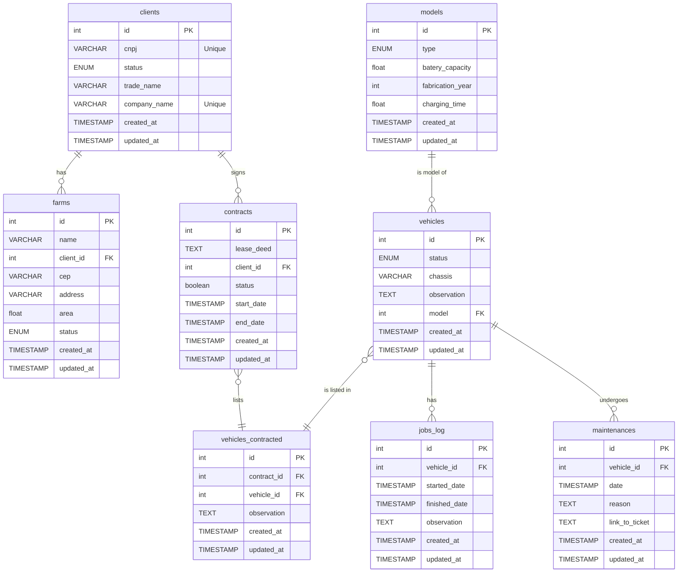

# Banco Relacional (MySql)

## Database Schema Flowchart

> [!IMPORTANT]
> A modelagem em sí será apenas possível ser vista pelo github no documento [mysql_estrutura.md](https://github.com/GustavoBehnck/banco_de_dados_2/blob/main/docs/mysql_estrutura.md)

## Tabelas

### `clients`

| Column       | Type                                    | NotNull? | PK? | FK? | AutIncre? | Unique? |
| ------------ | --------------------------------------- | -------- | --- | --- | --------- | ------- |
| id           | INT                                     | yes      | yes | no  | yes       | yes     |
| cnpj         | VARCHAR(255)                            | yes      | no  | no  | no        | yes     |
| status       | ENUM("active", "inactive", "suspended") | yes      | no  | no  | no        | no      |
| trade_name   | VARCHAR(255)                            | yes      | no  | no  | no        | no      |
| company_name | VARCHAR(255)                            | yes      | no  | no  | no        | yes     |
| created_at   | TIMESTAMP                               | yes      | no  | no  | no        | no      |
| updated_at   | TIMESTAMP                               | yes      | no  | no  | no        | no      |

### `farm_addresses`

| Column              | Type         | NotNull? | PK? | FK? | AutIncre? | Unique? |
| ------------------- | ------------ | -------- | --- | --- | --------- | ------- |
| id                  | INT          | yes      | yes | no  | yes       | yes     |
| cep                 | VARCHAR(20)  | yes      | no  | no  | no        | no      |
| street              | VARCHAR(255) | yes      | no  | no  | no        | no      |
| number              | VARCHAR(50)  | yes      | no  | no  | no        | no      |
| complement          | VARCHAR(255) | no       | no  | no  | no        | no      |
| neighborhood        | VARCHAR(255) | yes      | no  | no  | no        | no      |
| city                | VARCHAR(255) | yes      | no  | no  | no        | no      |
| country_subdivision | VARCHAR(255) | no       | no  | no  | no        | no      |
| country             | VARCHAR(255) | yes      | no  | no  | no        | no      |
| created_at          | TIMESTAMP    | yes      | no  | no  | no        | no      |
| updated_at          | TIMESTAMP    | yes      | no  | no  | no        | no      |

### `farms`

| Column     | Type                                    | NotNull? | PK? | FK?                        | AutIncre? | Unique? |
| ---------- | --------------------------------------- | -------- | --- | -------------------------- | --------- | ------- |
| id         | INT                                     | yes      | yes | no                         | yes       | yes     |
| name       | VARCHAR(255)                            | yes      | no  | no                         | no        | no      |
| client_id  | INT                                     | yes      | no  | yes -> `clients.id`        | no        | no      |
| address_id | INT                                     | yes      | no  | yes -> `farm_addresses.id` | no        | no      |
| area       | FLOAT                                   | yes      | no  | no                         | no        | no      |
| status     | ENUM("active", "inactive", "suspended") | yes      | no  | no                         | no        | no      |
| created_at | TIMESTAMP                               | yes      | no  | no                         | no        | no      |
| updated_at | TIMESTAMP                               | yes      | no  | no                         | no        | no      |

### `models`

| Column           | Type                                       | NotNull? | PK? | FK? | AutIncre? | Unique? |
| ---------------- | ------------------------------------------ | -------- | --- | --- | --------- | ------- |
| id               | INT                                        | yes      | yes | no  | yes       | yes     |
| type             | ENUM("planting", "spraying", "harvesting") | yes      | no  | no  | no        | no      |
| batery_capacity  | FLOAT                                      | yes      | no  | no  | no        | no      |
| fabrication_year | INT                                        | yes      | no  | no  | no        | no      |
| charging_time    | FLOAT                                      | yes      | no  | no  | no        | no      |
| created_at       | TIMESTAMP                                  | yes      | no  | no  | no        | no      |
| updated_at       | TIMESTAMP                                  | yes      | no  | no  | no        | no      |

### `vehicles`

| Column      | Type                                                   | NotNull? | PK? | FK?                | AutIncre? | Unique? |
| ----------- | ------------------------------------------------------ | -------- | --- | ------------------ | --------- | ------- |
| id          | INT                                                    | yes      | yes | no                 | yes       | yes     |
| status      | ENUM("in use", "ready", "decommissioned", "not ready") | yes      | no  | no                 | no        | no      |
| chassis     | VARCHAR(255)                                           | yes      | no  | no                 | no        | no      |
| observation | TEXT                                                   | no       | no  | no                 | no        | no      |
| model_id    | INT                                                    | yes      | no  | yes -> `models.id` | no        | no      |
| created_at  | TIMESTAMP                                              | yes      | no  | no                 | no        | no      |
| updated_at  | TIMESTAMP                                              | yes      | no  | no                 | no        | no      |

### `contracts`

| Column     | Type      | NotNull? | PK? | FK?                 | AutIncre? | Unique? |
| ---------- | --------- | -------- | --- | ------------------- | --------- | ------- |
| id         | INT       | yes      | yes | no                  | yes       | yes     |
| lease_deed | TEXT      | yes      | no  | no                  | no        | no      |
| client_id  | INT       | yes      | no  | yes -> `clients.id` | no        | no      |
| status     | BOOLEAN   | yes      | no  | no                  | no        | no      |
| start_date | TIMESTAMP | yes      | no  | no                  | no        | no      |
| end_date   | TIMESTAMP | yes      | no  | no                  | no        | no      |
| created_at | TIMESTAMP | yes      | no  | no                  | no        | no      |
| updated_at | TIMESTAMP | yes      | no  | no                  | no        | no      |

### `vehicles_contracts`

| Column      | Type      | NotNull? | PK? | FK?                   | AutIncre? | Unique? |
| ----------- | --------- | -------- | --- | --------------------- | --------- | ------- |
| id          | INT       | yes      | yes | no                    | yes       | yes     |
| contract_id | INT       | yes      | no  | yes -> `contracts.id` | no        | no      |
| vehicle_id  | INT       | yes      | no  | yes -> `vehicles.id`  | no        | no      |
| observation | TEXT      | no       | no  | no                    | no        | no      |
| created_at  | TIMESTAMP | yes      | no  | no                    | no        | no      |
| updated_at  | TIMESTAMP | yes      | no  | no                    | no        | no      |

### `jobs_log`

| Column        | Type      | NotNull? | PK? | FK?                  | AutIncre? | Unique? |
| ------------- | --------- | -------- | --- | -------------------- | --------- | ------- |
| id            | INT       | yes      | yes | no                   | yes       | yes     |
| vehicle_id    | INT       | yes      | no  | yes -> `vehicles.id` | no        | no      |
| started_date  | TIMESTAMP | yes      | no  | no                   | no        | no      |
| finished_date | TIMESTAMP | yes      | no  | no                   | no        | no      |
| observation   | TEXT      | no       | no  | no                   | no        | no      |
| created_at    | TIMESTAMP | yes      | no  | no                   | no        | no      |
| updated_at    | TIMESTAMP | yes      | no  | no                   | no        | no      |

### `maintenances`

| Column         | Type      | NotNull? | PK? | FK?                  | AutIncre? | Unique? |
| -------------- | --------- | -------- | --- | -------------------- | --------- | ------- |
| id             | INT       | yes      | yes | no                   | yes       | yes     |
| vehicle_id     | INT       | yes      | no  | yes -> `vehicles.id` | no        | no      |
| date           | TIMESTAMP | yes      | no  | no                   | no        | no      |
| reason         | TEXT      | yes      | no  | no                   | no        | no      |
| link_to_ticket | TEXT      | yes      | no  | no                   | no        | no      |
| created_at     | TIMESTAMP | yes      | no  | no                   | no        | no      |
| updated_at     | TIMESTAMP | yes      | no  | no                   | no        | no      |