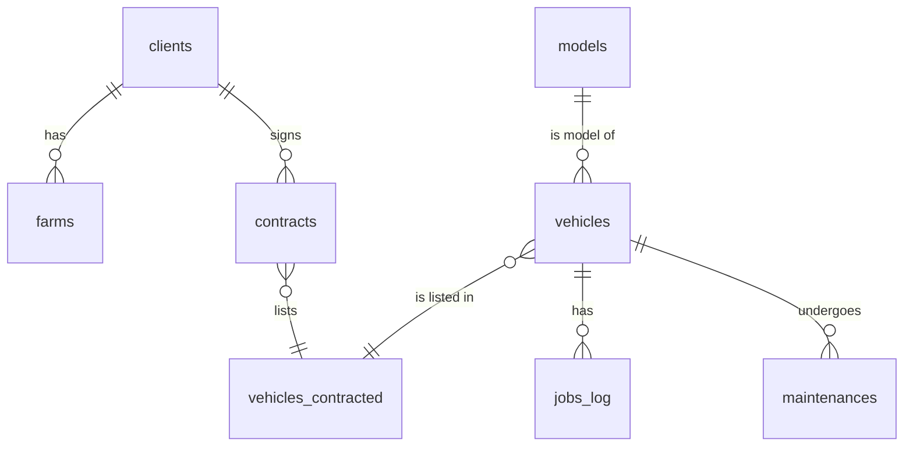

# Banco Relacional (MySql)

## Database Schema Flowchart

## Tabelas

### `clients`

| Column       | Type                                  | NotNull? | PK? | FK? | AutIncre? | Unique? |
| ------------ | ------------------------------------- | -------- | --- | --- | --------- | ------- |
| id           | int                                   | yes      | yes | no  | yes       | yes     |
| cnpj         | VARCHAR                               | yes      | no  | no  | no        | yes     |
| status       | ENUM("active","inactive","suspended") | yes      | no  | no  | no        | no      |
| trade_name   | VARCHAR                               | yes      | no  | no  | no        | no      |
| company_name | VARCHAR                               | yes      | no  | no  | no        | yes     |
| created_at   | TIMESTAMP                             | yes      | no  | no  | no        | no      |
| updated_at   | TIMESTAMP                             | yes      | no  | no  | no        | no      |

### `farms`

| Column     | Type                                  | NotNull? | PK? | FK?               | AutIncre? | Unique? |
| ---------- | ------------------------------------- | -------- | --- | ----------------- | --------- | ------- |
| id         | int                                   | yes      | yes | no                | yes       | yes     |
| name       | VARCHAR                               | yes      | no  | no                | no        | no      |
| client_id  | int                                   | yes      | no  | yes -> clients.id | no        | no      |
| cep        | VARCHAR                               | yes      | no  | no                | no        | no      |
| address    | VARCHAR                               | no       | no  | no                | no        | no      |
| area       | float                                 | yes      | no  | no                | no        | no      |
| status     | ENUM("active","inactive","suspended") | yes      | no  | no                | no        | no      |
| created_at | TIMESTAMP                             | yes      | no  | no                | no        | no      |
| updated_at | TIMESTAMP                             | yes      | no  | no                | no        | no      |

### `vehicles`

| Column      | Type                                                | NotNull? | PK? | FK?             | AutIncre? | Unique? |
| ----------- | --------------------------------------------------- | -------- | --- | --------------- | --------- | ------- |
| id          | int                                                 | yes      | yes | no              | yes       | yes     |
| status      | ENUM("in use","ready","decommissioned","not ready") | yes      | no  | no              | no        | no      |
| chassis     | VARCHAR                                             | yes      | no  | no              | no        | no      |
| observation | TEXT                                                | no       | no  | no              | no        | no      |
| model       | int                                                 | yes      | no  | yes -> model.id | no        | no      |
| created_at  | TIMESTAMP                                           | yes      | no  | no              | no        | no      |
| updated_at  | TIMESTAMP                                           | yes      | no  | no              | no        | no      |

### `models`

| Column           | Type                                     | NotNull? | PK? | FK? | AutIncre? | Unique? |
| ---------------- | ---------------------------------------- | -------- | --- | --- | --------- | ------- |
| id               | int                                      | yes      | yes | no  | yes       | yes     |
| types            | ENUM("planting","spraying","harvesting") | yes      | no  | no  | no        | no      |
| batery_capacity  | float                                    | yes      | no  | no  | no        | no      |
| fabrication_year | int                                      | yes      | no  | no  | no        | no      |
| batery_capacity  | float                                    | yes      | no  | no  | no        | no      |
| charging_time    | float                                    | yes      | no  | no  | no        | no      |
| created_at       | TIMESTAMP                                | yes      | no  | no  | no        | no      |
| updated_at       | TIMESTAMP                                | yes      | no  | no  | no        | no      |

### `contracts`

| Column     | Type      | NotNull? | PK? | FK?               | AutIncre? | Unique? |
| ---------- | --------- | -------- | --- | ----------------- | --------- | ------- |
| id         | int       | yes      | yes | no                | yes       | yes     |
| lease_deed | TEXT      | yes      | no  | no                | no        | no      |
| client_id  | int       | yes      | no  | yes -> clients.id | no        | no      |
| status     | boolean   | yes      | no  | no                | no        | no      |
| start_date | TIMESTAMP | yes      | no  | no                | no        | no      |
| end_date   | TIMESTAMP | yes      | no  | no                | no        | no      |
| created_at | TIMESTAMP | yes      | no  | no                | no        | no      |
| updated_at | TIMESTAMP | yes      | no  | no                | no        | no      |

### `vehicles_contracted`

| Column      | Type      | NotNull? | PK? | FK?                 | AutIncre? | Unique? |
| ----------- | --------- | -------- | --- | ------------------- | --------- | ------- |
| id          | int       | yes      | yes | no                  | yes       | yes     |
| contract_id | int       | yes      | no  | yes -> contracts.id | no        | no      |
| vehicle     | int       | yes      | no  | yes -> vehicles.id  | no        | no      |
| observation | TEXT      | no       | no  | no                  | no        | no      |
| created_at  | TIMESTAMP | yes      | no  | no                  | no        | no      |
| updated_at  | TIMESTAMP | yes      | no  | no                  | no        | no      |

### `jobs_log`

| Column        | Type      | NotNull? | PK? | FK?               | AutIncre? | Unique? |
| ------------- | --------- | -------- | --- | ----------------- | --------- | ------- |
| id            | int       | yes      | yes | no                | yes       | yes     |
| vehile_id     | int       | yes      | no  | yes -> vehicle.id | no        | no      |
| started_date  | TIMESTAMP | yes      | no  | no                | no        | no      |
| finished_date | TIMESTAMP | yes      | no  | no                | no        | no      |
| observation   | TEXT      | no       | no  | no                | no        | no      |
| created_at    | TIMESTAMP | yes      | no  | no                | no        | no      |
| updated_at    | TIMESTAMP | yes      | no  | no                | no        | no      |

### `maintenances`

| Column         | Type      | NotNull? | PK? | FK?               | AutIncre? | Unique? |
| -------------- | --------- | -------- | --- | ----------------- | --------- | ------- |
| id             | int       | yes      | yes | no                | yes       | yes     |
| vehile_id      | int       | yes      | no  | yes -> vehicle.id | no        | no      |
| date           | TIMESTAMP | yes      | no  | no                | no        | no      |
| reason         | TEXT      | yes      | no  | no                | no        | no      |
| link_to_ticket | TEXT      | yes      | no  | no                | no        | no      |
| created_at     | TIMESTAMP | yes      | no  | no                | no        | no      |
| updated_at     | TIMESTAMP | yes      | no  | no                | no        | no      |

## Banco **Não** Relacional (InfluxDB)

